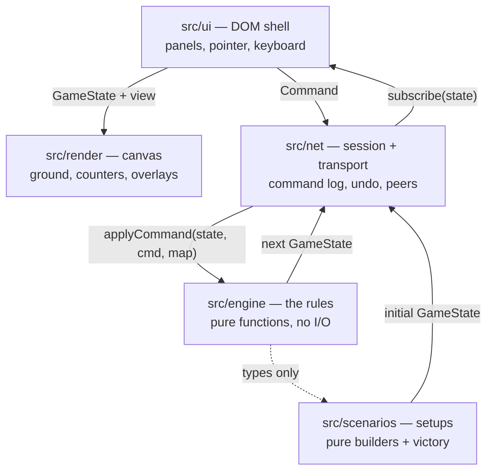

# Architecture

Four layers with one rule between them: **only the engine decides anything.**
Everything else draws, listens, or carries messages.



Arrows point the way data flows, and there are no arrows back into the engine
except commands. `src/engine` imports nothing from `src/ui`, `src/render`,
`src/net` or `src/scenarios`.

---

## The engine is a pure function

`GameState` is a plain JSON value — hexes are `{q, r}`, units live in a record
keyed by id, and nothing in it is a class, a `Map`, a `Set`, or a closure.
Rejections return the state they were given, untouched.

Three things are banned outright inside `src/engine` and `src/scenarios`, and
the lint config enforces all three:

| Banned                | Why                                                                                                   |
| --------------------- | ----------------------------------------------------------------------------------------------------- |
| `Math.random()`       | Every die goes through `rng.ts`, whose entire state is one 32-bit integer carried inside `GameState`. |
| `Date` / `Date.now()` | A rules decision that depends on the wall clock cannot be replayed.                                   |
| DOM globals           | The engine runs in a browser tab, in a Node test, and (one day) on a server, unchanged.               |

The payoff is that **the same command log always produces the same game.** From
that one property you get, for free: undo (replay the log without its last
entry), save/load (a save file is the starting position plus the log),
multiplayer (peers exchange commands, never state), and hermetic tests.

Dice are threaded, never ambient:

```ts
const { state: rng, value } = rollDie(state.rng);
return { ...state, rng };
```

A function that forgets to thread `rng` back into the state is a bug that shows
up immediately as a repeated roll, which is why every roll site is written in
this shape.

---

## Layer by layer

### `src/engine` — the rules

| File          | Owns                                                                                                                                        |
| ------------- | ------------------------------------------------------------------------------------------------------------------------------------------- |
| `hex.ts`      | Flat-top axial coordinates, distance (which _is_ range in Ogre — there is no line of sight), hexsides, and the map's printed `1401` labels. |
| `terrain.ts`  | The five terrain tables of 5.08, organised by running gear, plus the combat effects of 7.14.                                                |
| `map.ts`      | The indexed board. Roads are links across hexsides, not flags on hexes, because that is what "moving along the line of the road" means.     |
| `mapdata.ts`  | The generators. Two boards, from a seed.                                                                                                    |
| `units.ts`    | Every counter's statistics, and where each number came from.                                                                                |
| `ogres.ts`    | Ogre components, the tread track, and the Size Table.                                                                                       |
| `crt.ts`      | The combat results table and the odds ladder. No state, no dice.                                                                            |
| `types.ts`    | `GameState` and everything in it. A fixed contract.                                                                                         |
| `commands.ts` | The command union — the complete list of things a player can do.                                                                            |
| `state.ts`    | Construction and the immutable-update helpers.                                                                                              |
| `movement.ts` | Paths, the road bonus, stacking, hazards, recovery, mounting.                                                                               |
| `combat.ts`   | Gunnery, spillover, the two Ogre-specific targeting rules.                                                                                  |
| `ram.ts`      | Section 6 in full, in both directions.                                                                                                      |
| `overrun.ts`  | Section 8: the point-blank sub-turn, with its own initiative and its own arithmetic.                                                        |
| `reducer.ts`  | The one entry point: `applyCommand` routes and runs the phase machinery.                                                                    |

Three engine decisions are worth calling out.

**Movement is a path problem, not a hex problem.** The road bonus is a property
of the whole phase ("stays on the road for the entire movement phase"), and a
stream may only be crossed by a unit that began the phase beside it. Neither can
be judged one step at a time, so `planPath` accepts or rejects a whole path.

**An Ogre is never a target.** `TargetRef` has separate variants for a weapon
and for the treads, and `previewAttack` refuses a bare `{kind: 'unit'}` aimed at
an Ogre with a message saying so. The treads variant does not touch the odds
ladder at all.

**An overrun is a sub-turn inside the movement phase.** `GameState.overrun`
suspends movement, and while it is set the player entitled to act is the side
_firing_, not the side whose turn it is — the defender goes first (8.04). It is
the only place in Ogre where that happens, and `applyCommand` special-cases it
rather than letting every module wonder whose turn it is.

**Terrain damage lives in the state, not the map.** `GameMap` is immutable
scenery that can be shared between games; craters, rubble and cut roads go in
`GameState.terrainOverrides` and `routesCut`, so a game replays exactly.

### `src/scenarios` — the setups

Data plus two pure functions: `build(opts)` turns a seed into a starting
`GameState`, and `checkVictory(state)` reads a state and says whether anyone has
won. Deployment is randomised through a seeded generator, so a seed reproduces a
board exactly and a different seed is a different battle plan — which is what
the rulebook means by "This is an example ... NOT the only legal setup!"

### `src/net` — session and transport

`GameSession` is the only object the shell holds. It owns the current state, the
accepted-command log, the subscriber list, and — optionally — a `Transport`.

```ts
const session = new GameSession(scenario.build({ seed }), scenario.map, {
  victoryCheck: scenario.checkVictory,
});
session.subscribe(() => redraw(session.state));
const result = session.dispatch({ type: 'ram', by: 'ogre', unit: 'mk3', target });
if (!result.ok) toast(result.reason);
```

A `Transport` moves commands and nothing else. `LocalTransport` is a no-op for
hot seat; `BroadcastChannelTransport` links tabs of one browser.

### `src/render` — the board

An immediate-mode canvas renderer. It reads a `GameState` and a `RenderView`
(selection, reachable hexes, ram targets, queued attackers) and draws; it holds
no game state and dispatches no commands. Per-hex variation comes from a _hash_
of the coordinates, never from the game's generator — the renderer must not
consume dice, and the same hex must look the same on every client.

### `src/ui` — the shell

Panels, pointer and keyboard bindings, and the one-way loop:

```
command → session.dispatch → subscribe → render(panels + map)
```

The shell asks the engine every legality question (`reachable`, `previewAttack`,
`canRam`) rather than reimplementing any of it. The one place it exercises
judgement is presentation: a Mark V has twenty-six weapons, and the fire panel
groups them by kind with a count, because "both secondaries on the GEV" is how a
player thinks and twenty-six checkboxes is not.

### `src/ui/ports.ts` and `src/main.ts` — the wiring

The shell is written against structural ports (`SessionPort`, `RendererPort`),
not against `GameSession` and `MapRenderer` directly. `main.ts` is the single
adapter layer where those ports meet the real objects.

---

## Immutability

`GameState` is frozen by convention rather than by `Object.freeze` — freezing
every state in a replay is measurable, and the convention has held. Updates go
through the helpers in `state.ts`:

```ts
const next = updateOgre(state, ogre.id, (o) => ({ treads: o.treads - 4 }));
```

Never mutate in place. The renderer, the panels and the undo log all hold
references to previous states, and a mutation makes a game's history
retroactive.

---

## Testing

`npm test` runs vitest over `tests/**/*.test.ts`. Three kinds of test earn their
keep:

1. **Tables and geometry** — the CRT, the odds ladder and the hex maths are
   transcriptions, and are tested against the rulebook's own worked examples.
2. **Rule scenarios** — put three counters on a bare board, fix the die by
   searching for a seed that produces it, dispatch a command, assert on the
   result. Hermetic because the engine is pure.
3. **Provenance** — `tests/stats.test.ts` asserts that values the rules text
   pins down are right _and_ that values it does not are still flagged, so
   `docs/RULES-MAPPING.md` cannot go stale.

---

## Adding to the game

- **A new rule** → the engine module that owns it, with the rulebook phrase
  quoted in a comment. If it needs a new player action, add a variant to the
  `Command` union first; the reducer and the shell will fail to compile until
  they handle it, which is the point.
- **A new scenario** → a `ScenarioDef` in `src/scenarios`. No engine changes:
  scenario-specific state rides in `scenarioData`.
- **A new view** → a panel in `src/ui/app.ts`, reading `GameState` and emitting
  commands. Nothing else needs to know it exists.
