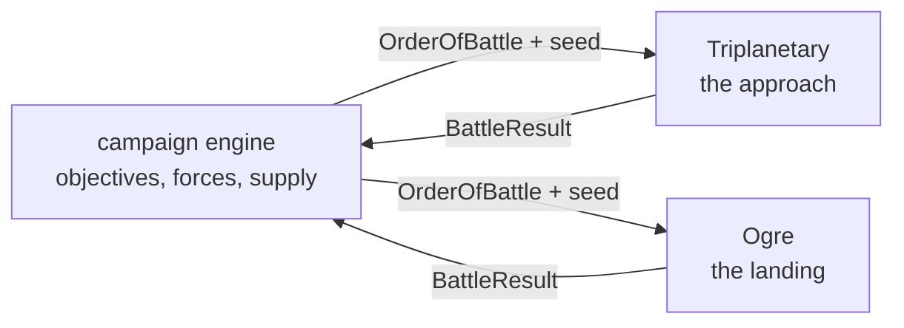

# Linking Ogre and Triplanetary

> **Status.** Design only. Nothing in this document is implemented. It exists so
> that the two engines stay shaped for it while they are being built, and so the
> decisions that would be expensive to reverse are made deliberately rather than
> by accident.

The companion project is
[Triplanetary-VTT](https://github.com/onlinemph/Triplanetary-VTT): vector
movement, the inner Solar System, and the same architecture — a pure engine, a
seeded generator inside the state, a game that is its seed plus a command log.

Two games, one war. Triplanetary decides who gets to the ground; Ogre decides
what happens when they land.

---

## Why the two fit

They were built to the same contract, which is most of the work:

|           | Triplanetary                          | Ogre                     |
| --------- | ------------------------------------- | ------------------------ |
| Engine    | `applyCommand(state, cmd, map)`, pure | the same                 |
| Dice      | mulberry32, state inside `GameState`  | the same                 |
| A game is | scenario seed + command log           | the same                 |
| Scenario  | `build(opts)` + `checkVictory(state)` | the same                 |
| Hexes     | pointy-top, axial `{q, r}`            | flat-top, axial `{q, r}` |

The hex orientation differs because the two games' printed maps differ — a star
chart is pointy-top, a wargame map with `1401` column-row numbering is flat-top
— and that is a rendering concern, not a shared-state one. Nothing about a
campaign needs the two boards to agree.

---

## The shape of a campaign

A campaign is a third pure engine that owns neither battle. It holds a map of
objectives, a pool of forces, and a log of its own; a battle is something it
_launches_ and then reads a result from.



Two boundary types carry everything across, and they are deliberately small:

```ts
/** What the campaign hands a battle. */
interface OrderOfBattle {
  readonly battleId: string;
  readonly seed: number;
  readonly scenarioId: string;
  readonly sides: readonly {
    readonly player: string;
    readonly faction: string;
    /** Engine-specific unit ids with counts: 'HVY' x4, or 'destroyer' x2. */
    readonly forces: Readonly<Record<string, number>>;
  }[];
  /** Free-form terms the scenario understands (entry edges, turn limits). */
  readonly terms: Readonly<Record<string, unknown>>;
}

/** What a battle hands back. */
interface BattleResult {
  readonly battleId: string;
  readonly winners: readonly string[];
  readonly level: 'complete' | 'standard' | 'marginal';
  /** Per side: what walked away, in the same vocabulary as `forces`. */
  readonly survivors: Readonly<Record<string, Readonly<Record<string, number>>>>;
  readonly victoryPoints: Readonly<Record<string, number>>;
  /** The whole battle, for replay: its seed and its command log. */
  readonly replay: { readonly seed: number; readonly log: readonly unknown[] };
}
```

Both engines can already produce a `BattleResult` without changes: `victory`,
`players[].victoryPoints`, and the surviving units are all in `GameState`, and
`GameSession.serialise()` is the replay. Consuming an `OrderOfBattle` needs one
new thing in each — a scenario that builds from a supplied force list rather
than a fixed allowance — which is a scenario, not an engine change.

---

## The fiction that makes it work

Ogre's setting is a 21st-century Earth of the Combine and the Paneuropean
Federation. Triplanetary's is the inner Solar System. The join is the obvious
one and it is already in Ogre's own preface: the war is fought over resources,
and the resources are not all on Earth.

A campaign turn, then:

1. **Strategic.** Both sides allocate production between fleets and ground
   forces, and declare objectives.
2. **Space.** Contested transfers are fought in Triplanetary. Who arrives, and
   with how much fuel and cargo, is the output.
3. **Ground.** A side that achieves orbit lands. What it lands _with_ is the
   surviving cargo capacity from step 2, converted into an Ogre order of battle.
4. **Consolidation.** Ground results change who holds what, which changes
   production, which changes step 1.

The conversion in step 3 is the only genuinely new rule, and it is one table:
cargo mass to armour units. Ogre already prices everything in armour units
(1.07) and Triplanetary already prices cargo in mass, so the table is short and
it is the campaign's to own — neither game engine needs to know it exists.

---

## Decisions worth making now

These are cheap today and expensive later.

**Keep `scenarioData` free-form.** Both engines carry a
`Readonly<Record<string, unknown>>` for scenario bookkeeping. A campaign's
battle terms ride in it. Do not tighten it into a fixed shape.

**Keep victory a value, not a callback into the shell.** `VictoryState` is data
in the state. A campaign reads it; it does not need to observe the battle.

**Keep the command log serialisable and complete.** A campaign that stores
`{seed, log}` per battle can replay any engagement in the war years later. That
only holds while nothing in either engine reads the clock or `Math.random`, which
is the property the lint config already enforces.

**Do not share a package yet.** The temptation is to extract `hex.ts` and
`rng.ts` into a common library. Resist it until the campaign engine exists and
has told you what it actually needs; the two hex modules differ in orientation
and in what they consider a "side", and a premature merge would cost more than
the duplication does.

---

## What would have to be built

Roughly in order:

1. A `BattleResult` reader for each engine — small, pure, testable.
2. A scenario in each engine that builds from an `OrderOfBattle`.
3. The campaign engine itself: map, production, objectives, and its own log.
4. A conversion table between Triplanetary cargo and Ogre armour units.
5. A shell that can hold all three, and hand off between them.

Steps 1 and 2 are worth doing early even without the rest, because they are
independently useful: a scenario that builds from a force list is exactly what a
point-buy screen needs.
