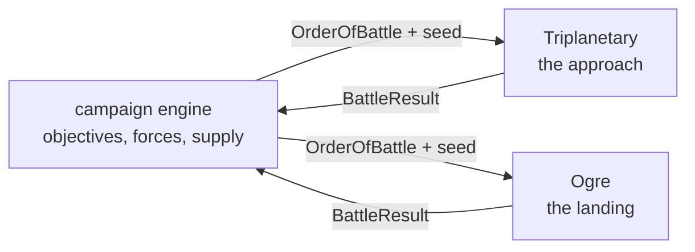

# Linking Ogre and Triplanetary

> **Status.** Implemented. This document was written first as a design — "it
> exists so that the two engines stay shaped for it while they are being
> built" — and the campaign now exists in the shape it drew. The design
> sections below are kept as written, because they explain _why_ the seams sit
> where they do; the sections at the end say what was built and how to play
> it.

The companion project is
[Triplanetary-VTT](https://github.com/onlinemph/Triplanetary-VTT): vector
movement, the inner Solar System, and the same architecture — a pure engine, a
seeded generator inside the state, a game that is its seed plus a command log.

Two games, one war. Triplanetary decides who gets to the ground; Ogre decides
what happens when they land.

---

## Why the two fit

They were built to the same contract, which is most of the work:

|           | Triplanetary                          | Ogre                     |
| --------- | ------------------------------------- | ------------------------ |
| Engine    | `applyCommand(state, cmd, map)`, pure | the same                 |
| Dice      | mulberry32, state inside `GameState`  | the same                 |
| A game is | scenario seed + command log           | the same                 |
| Scenario  | `build(opts)` + `checkVictory(state)` | the same                 |
| Hexes     | pointy-top, axial `{q, r}`            | flat-top, axial `{q, r}` |

The hex orientation differs because the two games' printed maps differ — a star
chart is pointy-top, a wargame map with `1401` column-row numbering is flat-top
— and that is a rendering concern, not a shared-state one. Nothing about a
campaign needs the two boards to agree.

---

## The shape of a campaign

A campaign is a third pure engine that owns neither battle. It holds a map of
objectives, a pool of forces, and a log of its own; a battle is something it
_launches_ and then reads a result from.



Two boundary types carry everything across, and they are deliberately small:

```ts
/** What the campaign hands a battle. */
interface OrderOfBattle {
  readonly battleId: string;
  readonly seed: number;
  readonly scenarioId: string;
  readonly sides: readonly {
    readonly player: string;
    readonly faction: string;
    /** Engine-specific unit ids with counts: 'HVY' x4, or 'destroyer' x2. */
    readonly forces: Readonly<Record<string, number>>;
  }[];
  /** Free-form terms the scenario understands (entry edges, turn limits). */
  readonly terms: Readonly<Record<string, unknown>>;
}

/** What a battle hands back. */
interface BattleResult {
  readonly battleId: string;
  readonly winners: readonly string[];
  readonly level: 'complete' | 'standard' | 'marginal';
  /** Per side: what walked away, in the same vocabulary as `forces`. */
  readonly survivors: Readonly<Record<string, Readonly<Record<string, number>>>>;
  readonly victoryPoints: Readonly<Record<string, number>>;
  /** The whole battle, for replay: its seed and its command log. */
  readonly replay: { readonly seed: number; readonly log: readonly unknown[] };
}
```

These live in `src/campaign/orders.ts` — in both repositories, duplicated
rather than shared (see "Decisions", below). The conventions the types cannot
state: `sides[0]` is the attacker and moves first, and `forces` speaks each
engine's own vocabulary — `UnitClassId`/`OgreTypeId` keys with infantry in
squads here; `ShipClass` keys plus `freight` for cargo lots there.

---

## The fiction that makes it work

Ogre's setting is a 21st-century Earth of the Combine and the Paneuropean
Federation. Triplanetary's is the inner Solar System. The join is the obvious
one and it is already in Ogre's own preface: the war is fought over resources,
and the resources are not all on Earth. Terra is deliberately not an objective
— the ground war there is the stalemate both sides are trying to break.

A campaign turn:

1. **Strategic.** Both sides spend production on fleets and ground forces, and
   either may commit to one offensive.
2. **Space.** Contested transfers are fought in Triplanetary. Who arrives, and
   with how much cargo, is the output. Routine logistics between friendly
   ports is below the campaign's resolution — only contested transfers are
   fought.
3. **Ground.** A side that achieves orbit lands. What it lands _with_ is the
   surviving cargo from step 2, converted into an Ogre order of battle.
4. **Consolidation.** Ground results change who holds what, which changes
   production, which changes step 1.

The conversion in step 3 is the only genuinely new rule, and it is one table
(`src/campaign/convert.ts`): **one cargo lot — ten tons of hold — lands one
armour unit of ground force.** Ogre already prices everything in armour units
(1.07) and Triplanetary already prices holds in tons, so the table is the
exchange rate and nothing else. A transport's 50-ton hold lands five armour
units; shipping a Mark V is a seventeen-lot convoy operation, which is the
campaign working as intended. Infantry pack three squads to the lot, the way
3.02 packs three squads to the counter. Neither game engine knows the table
exists.

---

## How to play it

Open the scenario screen in this app and press **Open the campaign** (the
campaign saves itself in the browser after every order, so the button reads
**Return to the war** once one is running). The war room is hot-seat: pick
whose orders you are giving, pass the keyboard, and end the turn when both
sides are done.

- **Buying and garrisoning** happen in the war room. Prices are in production
  points; held sites pay their production at each consolidation, and two
  thirds of the map's production wins the war.
- **An offensive** commits a convoy (which must lift the landing force's lots)
  and a ground force. The defender chooses: intercept, or let it pass.
- **A contested transfer** becomes a Triplanetary battle. The war room shows
  an order token and an **Open in Triplanetary** link; the transfer is fought
  there (hot seat, or against the computer), and the victory screen hands back
  a result token to paste into the war room. The tokens are the protocol —
  either battle can be fought on another machine entirely, by whoever holds
  the order token.
- **A landing** becomes an Ogre battle — the **Landing** scenario, built from
  whatever tonnage actually got down against whatever garrison is waiting.
  **Fight it here** plays it in this app and reports the result back with a
  button; the token route exists for remote play (`?battle=<token>` on either
  app's URL starts the battle it encodes).
- **Results are read, not typed.** Survivors return to pools or become the
  new garrison; a defeated landing force is stranded and lost; delivered
  tonnage is read off the board, not off a form.

Both battle scenarios are also on their scenario lists as ordinary scenarios
with printed default forces — a scenario that builds from a force list is
exactly what a point-buy screen needs, and playing them standalone is how the
defaults were tuned.

---

## What was built, and where

The build list the design ended with, as it landed:

1. **A `BattleResult` reader for each engine** — `src/campaign/result.ts` in
   each repository: a pure projection from a finished `GameState` (plus the
   command log) to a `BattleResult`. Triplanetary's maps its victory levels
   rank-for-rank (`decisive→complete, marginal→standard, moral→marginal`) and
   reads delivered tonnage off the board rather than the score.
2. **A scenario in each engine that builds from an `OrderOfBattle`** —
   `src/scenarios/landing.ts` here (a hot landing against a dug-in garrison,
   on the green map); `src/scenarios/contestedTransfer.ts` there (a convoy
   with the invasion in its holds, against the fleet that knows it is
   coming). Both fall back to printed defaults with no order, both refuse
   unit ids their engine does not know, and both stow the order in
   `scenarioData` so a battle carries its own terms.
3. **The campaign engine** — `src/campaign/engine.ts` here: sites, production,
   pools, one operation in flight at a time, its own seeded rng and command
   log. `src/campaign/session.ts` is the session facade; a saved campaign is
   a seed plus a log, and it carries the replay of every battle fought in it.
4. **The conversion table** — `src/campaign/convert.ts`, described above.
5. **A shell that can hold all three** — the war room (`src/ui/campaign.ts`),
   the token codec both apps share (`src/campaign/codec.ts`, duplicated and
   pinned by tests on both sides), and the `?battle=` door in each app's
   `main.ts`.

## Decisions, revisited

The "decisions worth making now" from the original design, and how they held:

**Keep `scenarioData` free-form.** Held, and it is what makes the whole thing
work: the order of battle rides in it, so victory checks and result readers
need nothing but the state.

**Keep victory a value, not a callback into the shell.** Held. The campaign
reads `BattleResult`s; it never observes a battle.

**Keep the command log serialisable and complete.** Held — and extended: every
`reportBattle` command holds the result, and every result holds its
`{seed, log}`, so a campaign save can replay any engagement in the war.

**Do not share a package yet.** Still holding. The boundary types and the
codec are duplicated file-for-file rather than extracted; the codec tests on
each side pin the wire format, which is the actual compatibility contract.
The two hex modules were never needed by the campaign at all — the doc
guessed right about that.
