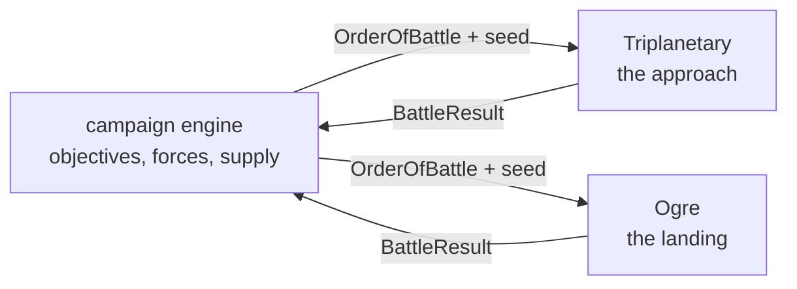

# Linking Ogre and Triplanetary

> **Status.** Implemented — and the campaign lives in the companion
> repository. This document was written first as a design ("it exists so that
> the two engines stay shaped for it while they are being built"), and the
> campaign was then built in the shape it drew. Its home is
> [Triplanetary-VTT](https://github.com/onlinemph/Triplanetary-VTT)
> (`src/campaign/`, and `docs/CAMPAIGN.md` there for how to play it), beside
> the online play that lets a contested transfer actually be contested by
> somebody on another machine. What lives in _this_ repository is the ground
> half: the battle boundary, and the scenario a landing builds. The design
> sections below are kept as written, because they explain why the seams sit
> where they do.

The companion project is
[Triplanetary-VTT](https://github.com/onlinemph/Triplanetary-VTT): vector
movement, the inner Solar System, and the same architecture — a pure engine, a
seeded generator inside the state, a game that is its seed plus a command log.

Two games, one war. Triplanetary decides who gets to the ground; Ogre decides
what happens when they land.

---

## Why the two fit

They were built to the same contract, which is most of the work:

|           | Triplanetary                          | Ogre                     |
| --------- | ------------------------------------- | ------------------------ |
| Engine    | `applyCommand(state, cmd, map)`, pure | the same                 |
| Dice      | mulberry32, state inside `GameState`  | the same                 |
| A game is | scenario seed + command log           | the same                 |
| Scenario  | `build(opts)` + `checkVictory(state)` | the same                 |
| Hexes     | pointy-top, axial `{q, r}`            | flat-top, axial `{q, r}` |

The hex orientation differs because the two games' printed maps differ — a star
chart is pointy-top, a wargame map with `1401` column-row numbering is flat-top
— and that is a rendering concern, not a shared-state one. Nothing about a
campaign needs the two boards to agree.

---

## The shape of a campaign

A campaign is a third pure engine that owns neither battle. It holds a map of
objectives, a pool of forces, and a log of its own; a battle is something it
_launches_ and then reads a result from.



Two boundary types carry everything across, and they are deliberately small:

```ts
/** What the campaign hands a battle. */
interface OrderOfBattle {
  readonly battleId: string;
  readonly seed: number;
  readonly scenarioId: string;
  readonly sides: readonly {
    readonly player: string;
    readonly faction: string;
    /** Engine-specific unit ids with counts: 'HVY' x4, or 'destroyer' x2. */
    readonly forces: Readonly<Record<string, number>>;
  }[];
  /** Free-form terms the scenario understands (entry edges, turn limits). */
  readonly terms: Readonly<Record<string, unknown>>;
}

/** What a battle hands back. */
interface BattleResult {
  readonly battleId: string;
  readonly winners: readonly string[];
  readonly level: 'complete' | 'standard' | 'marginal';
  /** Per side: what walked away, in the same vocabulary as `forces`. */
  readonly survivors: Readonly<Record<string, Readonly<Record<string, number>>>>;
  readonly victoryPoints: Readonly<Record<string, number>>;
  /** The whole battle, for replay: its seed and its command log. */
  readonly replay: { readonly seed: number; readonly log: readonly unknown[] };
}
```

These live in `src/campaign/orders.ts` — in both repositories, duplicated
rather than shared, because a package the two both depend on would couple
their release cycles over forty lines of types. The codec beside them
(`src/campaign/codec.ts`) turns orders and results into pasteable tokens, and
the codec tests on each side pin the wire format — the two copies _are_ the
compatibility contract. The conventions the types cannot state: `sides[0]` is
the attacker and moves first, and `forces` speaks each engine's own
vocabulary — `UnitClassId`/`OgreTypeId` keys with infantry in squads here;
`ShipClass` keys plus `freight` for cargo lots there.

---

## The fiction that makes it work

Ogre's setting is a 21st-century Earth of the Combine and the Paneuropean
Federation. Triplanetary's is the inner Solar System. The join is the obvious
one and it is already in Ogre's own preface: the war is fought over resources,
and the resources are not all on Earth. Terra is deliberately not an objective
— the ground war there is the stalemate both sides are trying to break.

A campaign turn:

1. **Strategic.** Both sides spend production on fleets and ground forces, and
   either may commit to one offensive.
2. **Space.** Contested transfers are fought in Triplanetary. Who arrives, and
   with how much cargo, is the output. Routine logistics between friendly
   ports is below the campaign's resolution — only contested transfers are
   fought.
3. **Ground.** A side that achieves orbit lands. What it lands _with_ is the
   surviving cargo from step 2, converted into an Ogre order of battle.
4. **Consolidation.** Ground results change who holds what, which changes
   production, which changes step 1.

The conversion in step 3 is the only genuinely new rule, and it is one table:
**one cargo lot — ten tons of hold — lands one armour unit of ground force.**
Ogre already prices everything in armour units (1.07) and Triplanetary already
prices holds in tons, so the table is the exchange rate and nothing else.
Infantry pack three squads to the lot, the way 3.02 packs three squads to the
counter. The table is the campaign's to own — it lives beside the campaign
engine in Triplanetary-VTT, and neither game engine knows it exists.

---

## This repository's half

- **The Landing** (`src/scenarios/landing.ts`) — the scenario a campaign
  ground battle builds: a hot landing on the green map, the invader down on
  the western strip against a dug-in garrison and its command dome, forces on
  both sides arriving in the `OrderOfBattle`. Playable from the scenario list
  with a printed default, which is also what makes it independently useful —
  a scenario that builds from a force list is exactly what a point-buy screen
  needs.
- **The boundary** (`src/campaign/`) — the types, the token codec, and
  `readBattleResult`, the pure projection from a finished `GameState` (plus
  the command log) to a `BattleResult`.
- **The door** — a `?battle=<token>` URL starts the landing the token
  encodes; the war room's "Open in the Ogre app" link is exactly that URL.
  When the battle ends, the victory screen offers the result as a token to
  paste back into the war room. A token that will not decode — or one for a
  space battle, pasted at the wrong app — gets a sentence saying which app it
  wanted.

The Triplanetary app also embeds this game — `src/ogre/` there is this
repository's engine, renderer and all four scenarios, ported wholesale, with
the shell pruned to a mountable battle view behind an **Ogre** door on its
start menu — so a campaign is playable end to end on one page, and so is an
Ogre attack for its own sake. This app stays the standalone home of the game,
and the door above stays the way to fight a landing on a machine that only
has it.

How a whole campaign turn plays, and how the space half goes online, is
documented where the campaign lives:
[Triplanetary-VTT's docs/CAMPAIGN.md](https://github.com/onlinemph/Triplanetary-VTT/blob/main/docs/CAMPAIGN.md).

---

## Decisions, revisited

The "decisions worth making now" from the original design, and how they held:

**Keep `scenarioData` free-form.** Held, and it is what makes the whole thing
work twice over: the order of battle rides in it, so victory checks and result
readers need nothing but the state — and so does the _referee_, which recovers
the order from the stored board when an online sync rebuilds a campaign
battle's opening position.

**Keep victory a value, not a callback into the shell.** Held. The campaign
reads `BattleResult`s; it never observes a battle.

**Keep the command log serialisable and complete.** Held — and extended: every
battle report the campaign accepts holds the result, and every result holds
its `{seed, log}`, so a campaign save can replay any engagement in the war.

**Do not share a package yet.** Still holding. The boundary types and the
codec are duplicated file-for-file rather than extracted, and the campaign
engine itself was moved whole from this repository to Triplanetary-VTT —
possible precisely because nothing shared bound it here. It sits beside the
online play now, which is where its battles get fought.
